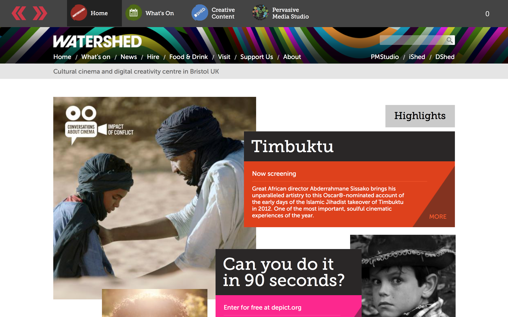

# rWeb

rWeb is Watershed's in house Web kiosk. It allows visitors to explore Watershed's wider cinema programme, DShed which showcases our previous projects and the Pervasive Media Studio.

The application was written in **Swift** and **Objective-C**.

We have stripped the application down so that you can implement your own Kiosk.

### What is in the Application?

There are 2 View Controllers. The Main Controller and the Saver Controller.

The Main Controller contains two WebView objects, a Header bar and the Main view.
We used the Header bar like a home panel where people could quickly access certain parts of our Website quickly. Any interactions in this bar were fired and loaded into the Main View.

The Saver Controller is a semi screen saver, containing one WebView. This is loaded with a promotional url which cycles through our custom what's on page.

### How to Customise
We have left some of the variables open for you to customise the kiosk. Simply open the Config.plist and add your own urls, regex strings and timings.

If you have any specific questions feel free to contact us.

